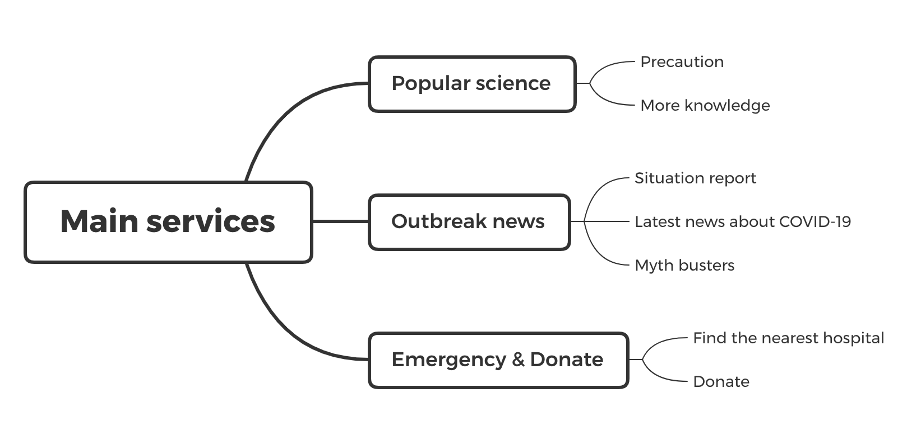

# A Line Chatbot with information about COVID-19
## This is a Line chatbot project about sharing public health information.    
### The design of our chatbot:    
The chatbot has three major queries: **The popular science knowledge, Latest news about the Coronavirus and Emergency & Donate**   
1. For the popular science knowledge part, when we type some key words like 'Popular science' in the chatbot, it will return us two options:
* Precaution: it will introduce us some currect and powerful means that can help us to prevent coronavirus COVID-19 infection.
* More scientific knowledge: it will return us many professional knowledge about virus and some specific knowledge about the coronavirus COVID-2019 in videos type.
2. For the latest news about the Coronavirus part, when we type some keywords like 'Outbreak news' to the chatbot, it will reply three options:   
* Real-time situation report, which is to show the real-time data report about the confirmed and supsened cases of COVID-19 in different countries or regions.   
* Latest news about COVID-19, which is to show the link of the latest developments in the outbreak.     
* Myth busters, which is to provide rumours dispelled by authority in case the pubilc suffer.      
3. For the Emergency & Donate part:
* Users can also send their location to find the nearest hospital from the chatbot.
* Users can donate material or money through the link for helping fight coronavirus.

### System architecture:

### [Want demo? click here](https://github.com/GeorgeeeLiu/Chatbot/blob/master/Chatbot_Demo.mp4)

### [More screenshots](https://github.com/GeorgeeeLiu/Chatbot/blob/master/screenshots.pdf)

### QR code of the LINE chatbot:

